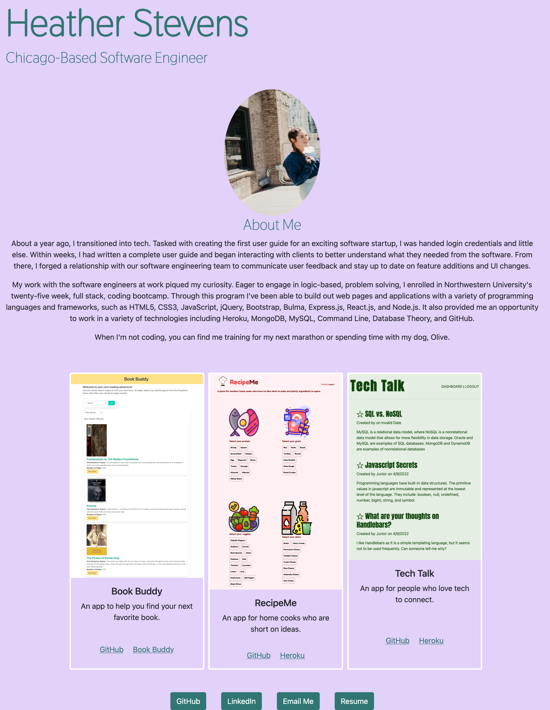

# Homework Fifteen - Developer Portfolio Revised

## Description

This portfolio was built using HTML, CSS, and Bootstrap as a styling framework.

This portfolio includes three main sections: About Me, Projects, and Contact Me. The projects section contains three projects, complete with images, a brief description, and links to the deployed application and the GitHub repo.

This site is accessible and mobile responsive.

## Screenshot

## Links to Application

- Here is a link to the repository: https://github.com/heatherveva/portfolio.git
- Here is the page: https://heatherveva.github.io/portfolio/
